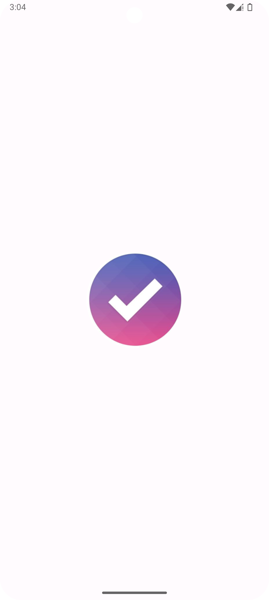
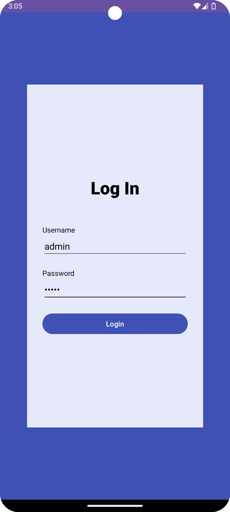
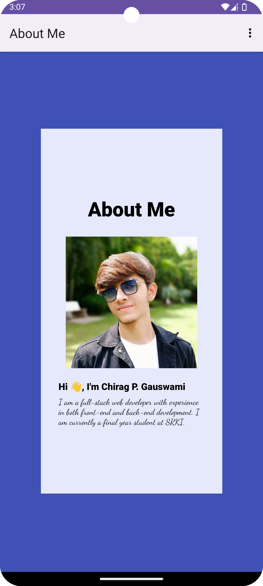
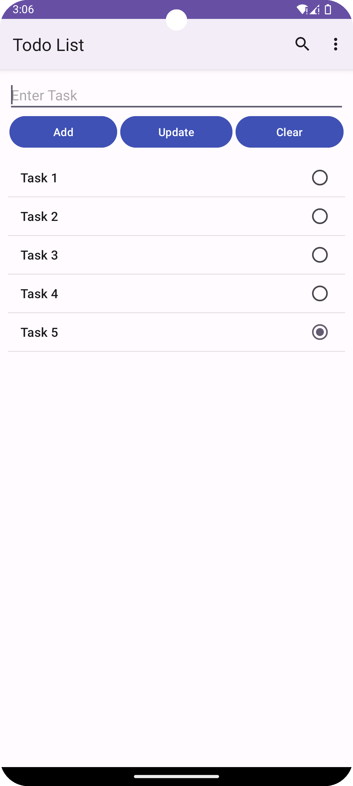
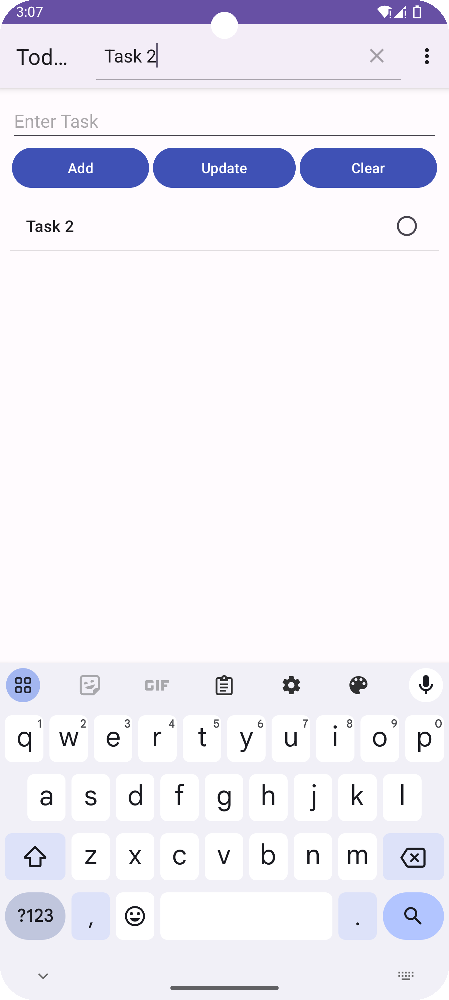
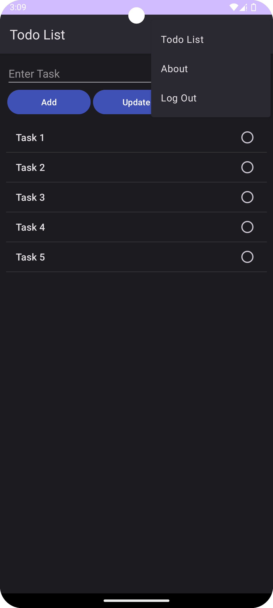

# Todo App

This Android mobile app allows users to manage their tasks efficiently. Users can add, update, delete individual tasks, delete all tasks at once, and search for specific tasks. The app includes a splash screen, a static login, an about page with an image and custom font style, and it supports dark mode. All tasks are stored in shared preferences.

## Screenshots


<br/>

<br/>

<br/>

<br/>

<br/>

<br/>

## Tech Stack

The app is built using the following technologies:

* Java
* Android Studio

## Features

* Static login with username: admin and password: admin
* Splash screen
* About page with an image and custom font style
* Add task
* Update task
* Delete task
* Delete all tasks
* Task search box
* Dark mode compatibility
* Tasks stored in shared preferences

## Usage

To use the Todo app, follow these steps:

1. Clone the repository:

```bash
   git clone https://github.com/chiragpgauswami/todo-app
```

2. Open the project in Android Studio.

3. Build and run the app on an emulator or physical device.

## Customization

You can customize the app's UI by modifying the XML layout files and Java code in Android Studio. Feel free to experiment with different colors, fonts, and layout arrangements.

## Contributing

Contributions are welcome! If you find any issues or want to add new features, please open an issue or submit a pull request.

## Author

This project was created by Chirag P. Gauswami.

## License

This project is open-source and available under the [MIT License](LICENSE).

## Links

- [Source Code](https://github.com/chiragpgauswami/todo-app)
- [Demo](https://github.comTodo.apk)

